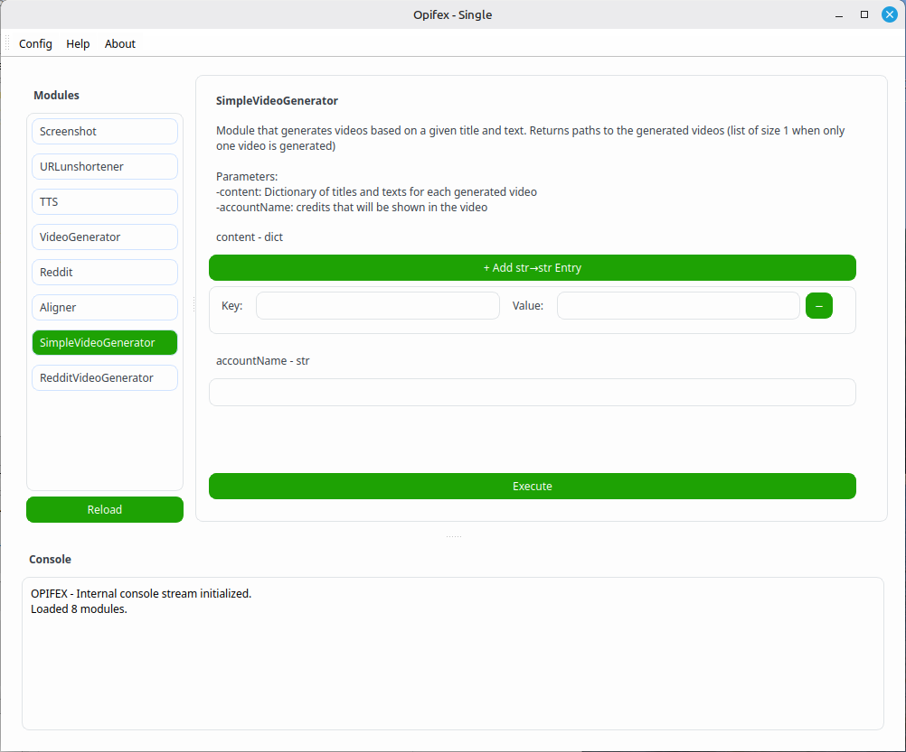

# Opifex

Manual for version `0.1.7`.

<p align="center">
  <a href="source/img/logo.png">
    
  </a>
</p>

_Opifex_ is a modular tool designed for automated content creation (videos, images, text, audio, and more, depending on which modules are installed and used).

## Quickstart

### For Debian-based distributions:

Clone the repository.

```bash
git clone https://github.com/Vprtp/opifex.git
cd opifex
```

Run the installation script.

```bash
bash install.sh
```

Start Opifex.

```bash
bash main.sh
```

### For other Linux distributions:

**Make sure that the following system packages, or compatible alternatives, are installed on your system:**
* _wget_
* _libxcb-xinerama0_
* _libxcb-cursor0_
* _libxkbcommon-x11-0_
* _libxcb-icccm4_
* _libxcb-image0_
* _libxcb-keysyms1_
* _libxcb-render-util0_
* _libxcb-shape0_
* _xvfb_
* _FFmpeg_ (with the _x11grab_ demuxer)

**If they're not, please install them by your preferred means before proceeding, or your Opifex installation won't work properly.**

Clone the repository.

```bash
git clone https://github.com/Vprtp/opifex.git
cd opifex
```

Run the installation script with the `--no-system-deps` flag.

```bash
bash install.sh --no-system-deps
```

Start Opifex.

```bash
bash main.sh
```

### Example use case: generating a short-form storytelling video from a Reddit post

1. Find a Reddit post with a long enough description that will act as the story (for example, posts in the _r/stories_ subreddit work particularly well).
2. Open Opifex in GUI mode with `bash main.sh` (See the `GUI mode` section below for instructions on how to use it).
3. Select the `RedditVideoGenerator` module.
4. Insert the post's URL inside the `url` parameter's text box.
5. Insert the name to which this video will be credited as the `accountName` parameter.
6. Click on the `Execute` button, then wait for completion (depending on how long the story is, this might take a few minutes).

In the end, something like this will be printed in the console:

```
ModuleResultType: exception <None> data <{'paths': ['/path/to/file.mp4']}>
```

where `/path/to/file.mp4` is the path to the generated video.

## Installation (in detail)

After downloading (or cloning) the repository, Opifex can be properly set up by running `bash install.sh` in the main directory.

The script will download various large assets (used by the program and default modules) that are too big to host on GitHub and it will set up a _Conda_ environment for the program (based on `environment.yml`), as well as install Conda (precisely _Miniconda3_) if no Conda version was found on the system.  
Opifex requires this environment to function properly, as some Conda-exclusive programs (such as _Montreal Forced Aligner_) are being used.

Opifex can then be started by running `bash main.sh` in the main directory.

(In both cases, please **avoid** running the scripts using other methods, for example `./main.sh`, since this way of execution might cause problems.)

So, as of now, **Opifex runs exclusively on Linux**.  
Also, the installer script currently only supports Debian-based distributions (or any distribution running _APT_): Opifex is still supported for other distributions, but it requires manual installation, check the `Quickstart` section above for more information.

Opifex uses its own Conda environment, but was designed and tested with **Python >= 3.12.0**.

## Modules

### What are modules?

**Modules** are independent pieces of code, each with a specific function, that can be executed through Opifex.  
Modules are Python scripts that can be found in the `modules` directory and that contain the `basemodule.BaseModule` class.  
They are imported upon startup and can be executed, with proper parameters, using `modules.executeModule()`, returning a class of type `basemodule.ModuleResultType`.

Based on this, in reality, the main program (for now) still just works as a layer for the user to call and interact with modules, which actually do the content creation operations.

**Be careful** when you download modules made by other people!  
By executing a module, you will be running code on your machine like any other program, so be certain that the downloaded script doesn't contain any malicious code.

### Default modules

Many modules are already part of Opifex by default, but everyone is free to write their own modules or download other community-made modules, by just placing them inside the `modules` directory. Here is a list of the preinstalled modules:

| **Module name**        | **File name**             | **Description**                                                                                                                                                                                  | **Required parameters**                                                        | **Returned values**                                              | **Dependencies**                                 |
|------------------------|---------------------------|--------------------------------------------------------------------------------------------------------------------------------------------------------------------------------------------------|--------------------------------------------------------------------------------|------------------------------------------------------------------|--------------------------------------------------|
| Aligner | alignSRT.py | Module for generating subtitles from a given audio and its transcript. | audio-(Path) transcript-(str) output-(Path) | textgridOutput-(Path) srtOutput-(Path) | N/A |
| ImageFinder | image_finder.py | Module that finds and downloads online images onto a given directory. | search-(str) destDir-(Path) | N/A | N/A |
| NewsVideoGenerator | news_video.py | Module that generates a news-broadcast style video. | broadcastName-(str) articles-(list) destination-(Path) | N/A | RecordPage TTS |
| RSS | rss.py | Module to fetch info from an RSS feed and its individual articles. | feedURL-(str) getFullArticle-(bool) | feedInfo-(dict) | N/A |
| RecordPage | record.py | Module that records a video of an HTML template with given parameter values. | template-(Path) data-(dict) size-(tuple) duration-(float) fps-(int) | destination-(Path) | ScreenshotPage |
| Reddit | reddit.py | Module for fetching reddit posts. | url-(str) upvotesMin-(float) wordsMin-(int) checkMax-(int) | title-(str) description-(str) upvotes-(int) comments-(list) | ScreenshotPage |
| RedditVideoGenerator | reddit_video_generator.py | Module that generates a video, or multiple videos, based on the content contained in a given Reddit post. Returns paths to the generated videos (list of size 1 when only one video is generated) | url-(str) commentsOrDesc-(bool) accountName-(str) | paths-(list) | Reddit SimpleVideoGenerator URLunshortener |
| ScreenshotPage | screenshot.py | Module that screenshots an HTML template with given parameter values to fill it and cleans it to be a transparent PNG. Note that model should not contain any '{' or '}' characters, if not for the parameters. Use separate stylesheet file to include CSS. Returns the path to the generated image. | template-(Path) data-(dict) size-(tuple) | destination-(Path) | N/A |
| SimpleVideoGenerator | simple_video_generator.py | Module that generates videos based on a given title and text. Returns paths to the generated videos (list of size 1 when only one video is generated) | content-(dict) accountName-(str) | paths-(list) | TTS Aligner VideoGenerator |
| TTS | tts.py | Module for generating speech from a given text. | text-(str) | destination-(Path) | N/A |
| URLunshortener | unshortenURL.py | Module that returns the final URL from redirections by a given one (thus 'unshortening' shortened URLs) | url-(str) rmpars-(bool) | url-(str) | N/A |
| VideoGenerator | video.py | Module for generating a short-form video based on given title, subtitles, audio for both title and text, and a destination path. | title-(str) subtitles-(str) titleAudio-(str) textAudio-(str) destination-(Path) | N/A | N/A |

### Creating modules

Creating modules is simple: all you have to do is write a Python script that does what you want it to do and attach a personalized `basemodule.BaseModule` class at the end of it, so that it can be recognized by Opifex.  
Be careful to put all your code in functions: anything outside them will be run when loading the module, because they are being imported as Python libraries.  
This is the structure of the `BaseModule` class:

```python
class BaseModule(ABC):
    def __init__(self):
        self.name:str = ""
        self.description:str = ""
        self.requiredArgs:List[Tuple[str,type]] = [] #list of required parameters as (name, type) pairs
        self.returnedDataTypes:List[Tuple[str,type]] = [] #list of returned key values and respective data types in returned data dict of ModuleResultType
        self.dependencies:List[str] = [] #list of "dependencies" (other modules' name) required for the module to work

    def __str__(self):
        return f"Module <{self.name}>: {self.description.split('\n')[0]}" #prints first line of description, which should always be just the summary. hopefully.
    
    @abstractmethod
    def execute(self, version:str, **kwargs) -> ModuleResultType: #version is the program version, it should be passed automatically by modules.executeModule()
        """Execute the module and return results"""
        pass
```

`YourModule.execute()` must return a variable of type `basemodule.ModuleResultType`, which will contain information about possible execution errors and data returned by the module.  
This is the structure of the `ModuleResultType` class:
```python
class ModuleResultType:
    def __init__(self, exception:Exception|None, data:Dict[str, Any]):
        self.exception = exception
        self.data = data
    
    def __str__(self):
        return f"ModuleResultType: exception <{str(self.exception)}> data <{str(self.data)}>"
```

So, in your module, you should include something like this:
```python
from basemodule import BaseModule, ModuleResultType

class YourModule(BaseModule):
    def __init__(self):
        self.name = "YourModuleName"
        self.description = "Description of your module (the more detailed it is, the better)"
        self.requiredArgs = [("put_required_parameters_here",str),("likethis",int),("orthis",dict[str,str])]
        self.returnedDataTypes = [("put_expected_returned_values_here",str),("example",bool)]
        self.dependencies = ["WriteHere","NamesOfModules","ThatThisOne","DependsOn"]
    
    def execute(self, version:str, **kwargs):
        try:
            valueOne:str = kwargs["put_required_parameters_here"]
            valueTwo:int = kwargs["likethis"]
            valueThree:dict[str,str] = kwargs["orthis"]
            
            #write here the execution code of your module
            #calling other functions instead of writing everything here will make it better
            
            return ModuleResultType(None,{"put_expected_return_values_here":yourStrReturnValue,"example":yourBoolReturnValue})
        except Exception as e:
            #remember that catching exceptions will prevent traceback from being printed.
            #if you want to print it, for debug purposes, uncomment this:
            #import traceback
            #print(traceback.format_exc())
            
            return ModuleResultType(e,{})
```

### Libraries

Like modules, all scripts within the `lib` folder will be imported upon startup: these are Opifex's custom **libraries**, which can also be written by users, but, differently from modules, libraries don't contain a specific identifier class and can only be executed from Python code, by importing them.

## GUI mode

Opifex can run in an intuitive **GUI mode**:

<p align="center">
  <a href="source/img/opifex-gui.png">
    
  </a>
</p>

The interface is divided into specialized sections:
* On the left, there's a list of all loaded **modules**. Each module can be inspected by _double clicking_. Modules can be reloaded by pressing the `Reload` button.
* On the right, details of the **selected module** are displayed. You can _execute_ the selected module by pressing the `Execute` button, after having provided all of the selected module's parameters.
* On the bottom, a **console** shows all output from modules and Opifex itself (after startup, all `stdout` and `stderr` calls get redirected here). The console can be cleared by pressing the `Clear` button.
* On the top, a **toolbar** allows you to have quick access to the _configurations file_, to this page and to a quick _info page_.

Output from **executed modules** will be printed to console (at least for now).

## Settings

Settings for Opifex can be changed in the `config.py` file, which can be easily accessed from the `Config` button in GUI mode's toolbar.

Opifex **must be restarted** after any setting change for the changes to take effect.

The configurations file is structured in these parts:  
* At the beginning, a few lines of code allow dynamic path detection. Do **not** modify this part. **Remember** to append the variable `p` at the beginning of a path string, if the given path is relative (not absolute).
* Then, some variables define some general characteristics about the Opifex program.
* Lastly, many variables used by built-in modules are defined. Modify these variables **only** if you know what you're doing.

The following settings are the ones you might be interested in changing the most.

### Window size

```python
windowSize:tuple[int,int] = (1000,800)
```

Size of the Opifex window in GUI mode upon startup (in pixels, width and height).

### GUI Themes

```python
style:str = p+"source/qt/light.qss"
```

Path to the stylesheet used for Opifex in GUI mode. Any stylesheet can be used, as long as it's in the Qt Stylesheet format.

These are the available stylesheets in a standard Opifex installation:
* `source/qt/light.qss` - light theme (default)
* `source/qt/dark.qss` - dark theme
* `source/qt/none.qss` - no custom theme, fallback to the default Qt style

### Localization settings

Currently, Opifex has not been translated to any language other than English **yet**. However, there are still some module settings which should be changed if you desire to use such modules in another language.

```python
piperModel:str = sourceFolder+"voice/en_US-lessac-medium.onnx"
alignerDict:str = sourceFolder+"aligner/english_us_mfa.dict"
alignerModel:str = sourceFolder+"aligner/english_mfa"
```

These variables contain paths to models and dictionaries for the _TTS_ module (which uses the software _PiperTTS_) and for the _Aligner_ module (which uses _Montreal Forced Aligner_). Only the English files for these programs are bundled with Opifex, but you can download models for other languages from their respective websites ([Piper](https://huggingface.co/rhasspy/piper-voices/tree/main), [MFA](https://github.com/MontrealCorpusTools/mfa-models)). Refer to their documentation for troubleshooting.

## Credits and info

All code for Opifex has been written by **prtp** ([Vprtp](https://github.com/Vprtp) on GitHub).  
Opifex is distributed under the [GNU GPL v3](LICENSE) license.  
To function properly, Opifex uses the following libraries/software (which are included with the installation of this program):
* _PyQt6_ for its graphical functionalities
* _PiperTTS_ for text-to-speech
* _Montreal Forced Aligner_ to align the generated TTS with its transcript and create a subtitles file
* _FFmpeg_ to edit and compose videos
* _Selenium_ to capture web pages


Opifex (from the Latin for "artisan" or "manufacturer") is a hobby project, so please be aware it may not yet be production-grade software. However, I still plan to add a lot of other things to it in future: first of all, a slightly more user-friendly GUI, then a CLI mode, the ability to run modules from shell commands (which could be very useful for scheduling), tons of other modules, and all of this just for the "single" mode (which runs entirely on the main machine), because I also plan to add a "master" mode that offloads processing to multiple machines running in "worker" mode. These changes will allow tons of possibilities for content automation, from homelabbing to industrial levels.

Thanks for your attention.
